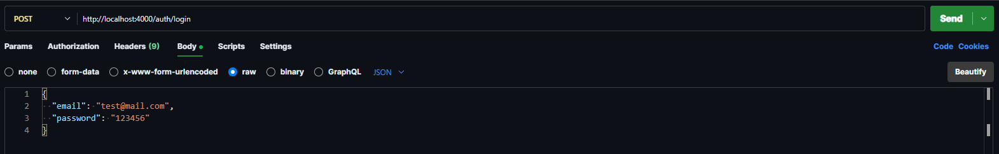
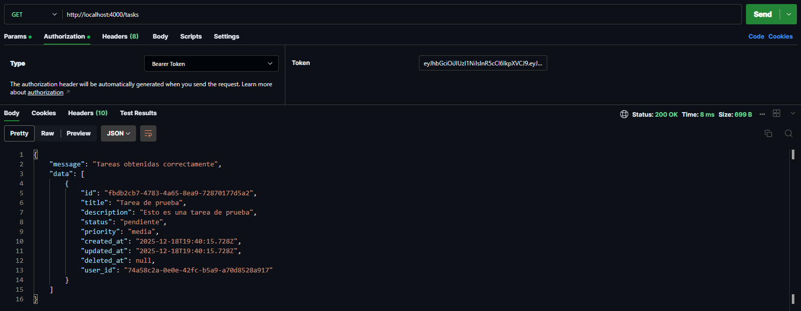
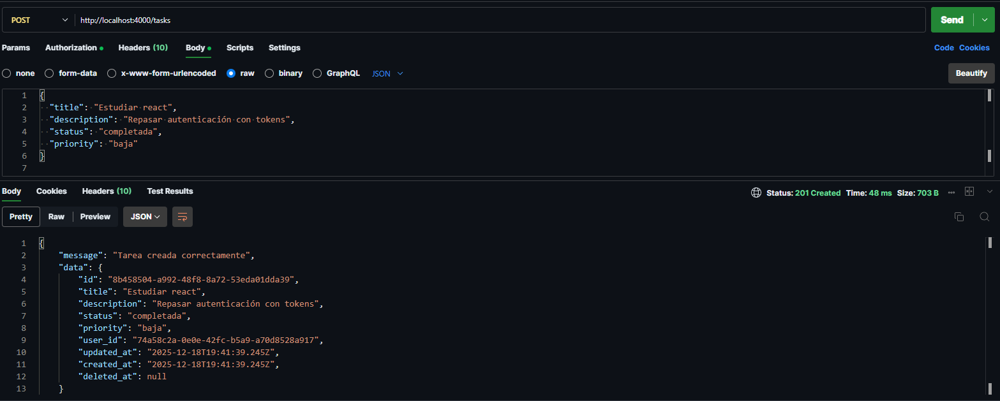
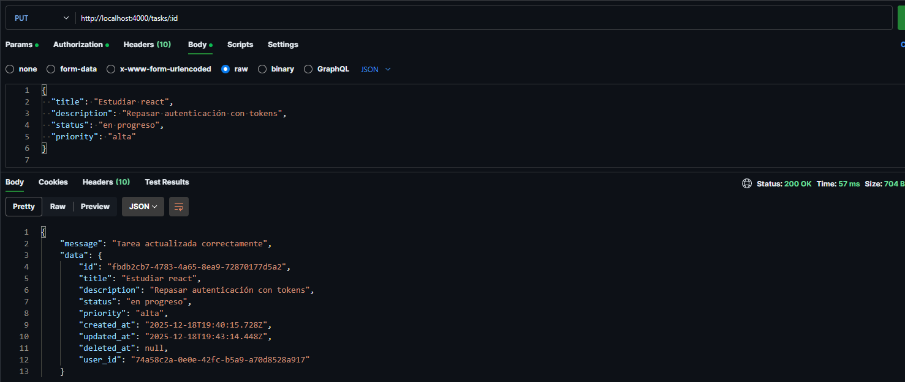

# Task Manager App — Backend API

Backend REST API desarrollada con **Node.js**, **Express** y **Sequelize**, utilizando **PostgreSQL** como base de datos.  
Este proyecto permite la **gestión de tareas por usuario**, incluyendo **registro y login**, autenticación con **JWT**, y operaciones CRUD protegidas por token.

La arquitectura sigue **buenas prácticas profesionales**, separando responsabilidades en **routes, controllers, validators, middlewares y models**.

---

## 🚀 Tecnologías utilizadas

- Node.js
- Express
- PostgreSQL
- Sequelize ORM
- JWT (JSON Web Tokens)
- bcrypt
- UUID
- express-validator
- dotenv
- cors

---

## 🛠️ Instalación del backend

1. Instalar las dependecias necesarias

```
npm install
```

2. Debe crear una base de datos con el nombre de su preferencia

3. Una vez creada la base de datos, debe colocar los datos correspondiente en la variable de entorno de ejemplo

4. Debe cambiar el nombre de .env.example por .env.

5. El valor de JWT_SECRET_KEY debe ser una cadena secreta fuerte y aleatoria, ya que es utilizada para firmar y verificar los tokens JWT.
   para generarlo ejecuta el siguiente comando en el terminal

```
node -e "console.log(require('crypto').randomBytes(32).toString('hex'))"
```

6. Esto generará una clave segura que debe ser copiada y reemplazarlo donde dice *your_jwt_secret_key*

7. Ejecuta el siguiente scripts personalizado para correr el backend en desarrollo

```
npm run backend
```
# 📖 Documentación de los Endpoints

La API se divide en dos secciones principales: Autenticación y Tareas.

Nota Importante: Todos los endpoints de /tasks están protegidos. Debes incluir el token JWT obtenido en el login dentro del Header de la petición: Authorization: Bearer <tu_token_aqui>

### 🔐 Autenticación (`/auth`)

Estas rutas son públicas y permiten la gestión de la identidad del usuario.

#### **POST** `/auth/register`
**Registrar nuevo usuario** Permite dar de alta a un usuario nuevo en la base de datos. Se debe enviar un objeto JSON con el `email` y el `password` deseados. La contraseña será encriptada antes de guardarse.


#### **POST** `/auth/login`
**Iniciar sesión** Verifica las credenciales del usuario. Si son correctas, el servidor responderá con un **Token JWT** (que debe guardarse en el cliente para futuras peticiones) y los datos básicos del usuario.



### 📋 Gestión de Tareas (`/tasks`)

Rutas protegidas para el manejo del tablero Kanban. El usuario solo puede acceder y modificar sus propias tareas.

#### **GET** `/tasks`
**Obtener todas las tareas** Recupera el listado completo de tareas creadas por el usuario autenticado.  
- **Filtros:** Admite parámetros opcionales en la URL (Query Params) para filtrar los resultados, por ejemplo: `?status=PENDING` o `?priority=HIGH`.



#### **POST** `/tasks`
**Crear una nueva tarea** Genera una nueva tarjeta en el tablero.  
- **Cuerpo de la petición:** Se requiere enviar el `title` (título). Opcionalmente se pueden enviar `description` (descripción), `priority` (prioridad) y `status` (estado).



#### **PUT** `/tasks/:id`
**Actualizar una tarea** Permite modificar cualquier campo de una tarea existente. Es utilizado tanto para editar el contenido (título/descripción) como para mover la tarea de columna (cambiar su `status`) y la columna (cambiar su `priority`).



#### **DELETE** `/tasks/:id`
Eliminación lógica de una tarea. Realiza un "Soft Delete" sobre el recurso. El registro no se borra físicamente de la base de datos, sino que se actualiza su campo deletedAt, permitiendo su posible restauración en el futuro.

