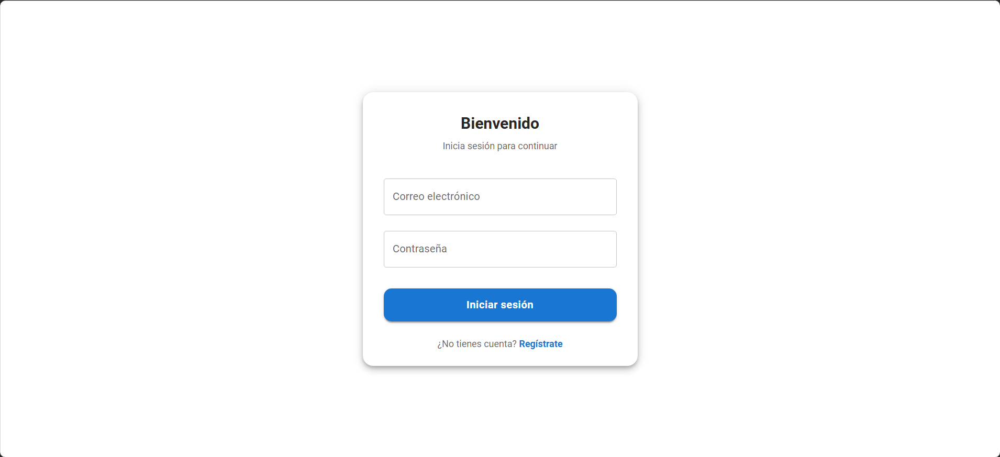
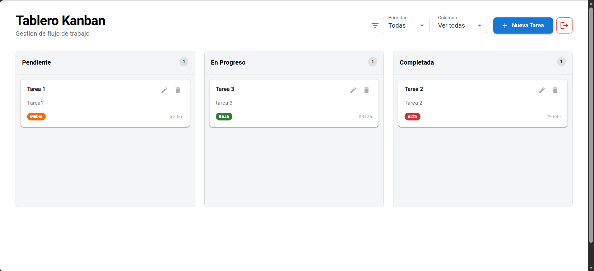
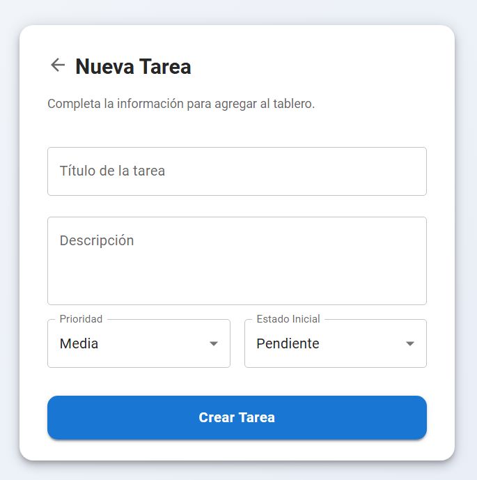
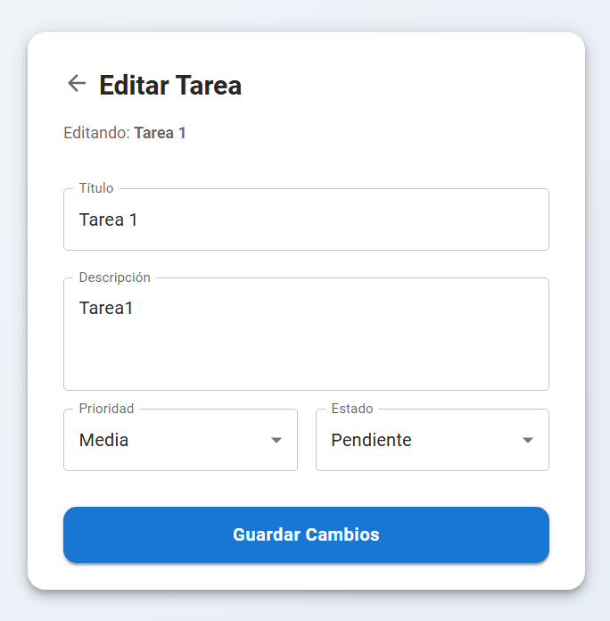

# Task Manager App — Frontend

Frontend de la aplicación de **Gestión de Tareas Kanban**, desarrollada con **React** y **Redux Toolkit**, utilizando **Material UI (MUI)** para una interfaz moderna y responsiva.

Esta aplicación implementa un tablero interactivo con funcionalidad **Drag & Drop** (arrastrar y soltar), gestión optimizada de estados, autenticación JWT y una arquitectura de servicios refactorizada para un manejo de errores limpio y escalable.

---

## 🚀 Tecnologías utilizadas

- **Core:** React, Vite
- **Estado Global:** Redux Toolkit (Auth & UI State)
- **UI Framework:** Material UI (MUI)
- **Drag & Drop:** @dnd-kit/core, @dnd-kit/sortable
- **Formularios:** React Hook Form
- **Navegación:** React Router DOM
- **Http Client:** Axios (con interceptores configurados)

---

## ✨ Características Principales Implementadas

### 1. Tablero Kanban Interactivo
- Funcionalidad completa de **Drag & Drop** para mover tareas entre columnas (Pendiente, En Progreso, Completada).
- Componentes visuales como `TaskCard` con indicadores de prioridad por colores (Chips).

### 2. Edición de Tareas Optimizada
- **Navegación con Estado:** Solución implementada para editar tareas sin necesidad de un endpoint `getTaskById`.
- La vista `TaskUpdate` recibe los datos directamente desde la tarjeta (`TaskCard`) a través de `location.state` de React Router, reduciendo las llamadas al servidor.

### 3. Autenticación y Seguridad
- Gestión de sesión con **JWT** y almacenamiento en Redux, el token es guardado en el localStorage para su uso.
- **Logout Integrado:** Botón de cierre de sesión en el `KanbanHeader` que limpia el estado y redirige al login.
- Protección contra expiración de token.

---

## 🛠️ Instalación del frontend

1. Instalar las dependencias necesarias:

```
npm install
```

2. Configurar las variables de entorno: Debe cambiar el nombre de .env.example por .env para configurar la URL base del backend.

3. Ejecuta el siguiente scripts personalizado para correr el backend en desarrollo

```
npm run frontend
```
## 🛠️ Vistas principales del frontend

Login de Inicio



Registro de usuario


Kanban de tareas (vista principal)



Creacion de la tarea



Edicion de la tarea

